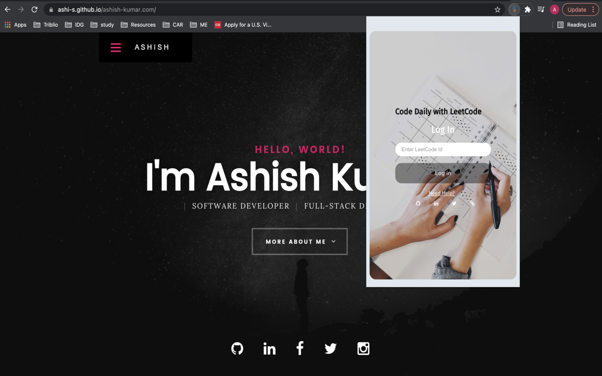
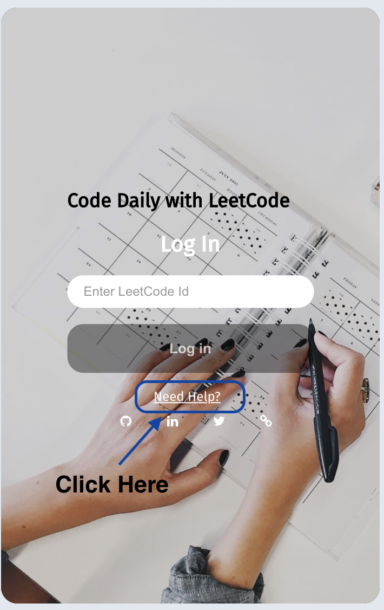
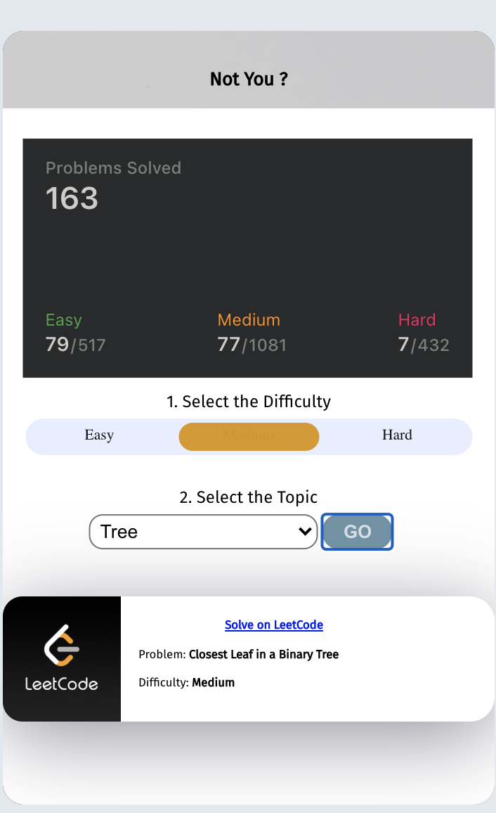

# leetcode-chrome-extension
A chrome extension built to motivate you to solve a coding problem daily, as simple as name of the extension **Code Daily with LeetCode**

## How to use this chrome extension

- You can either clone this GitHub repo or download it from the chrome web store(currently under review)
  ```sh
  git clone https://github.com/Ashi-s/leetcode-chrome-extension.git
  ```
  
  Follow these steps:
  ```sh
  1. Go to chrome://extensions in your Google Chrome browser
  2. Check the Developer mode checkbox in the top right-hand corner
  3. Click “Load Unpacked” to see a file-selection dialog
  4. Select your extension directory
  ```
  
- Once you have added the chrome-extension you can start using it directly, the only thing that you need is your **LeetCode Id**,
   [Click Me](https://leetcode.com/profile/account/) to get your **LeetCode Id**
   
  Alternatively, you can click ***Need Help?*** on the extension <br>
  
  
- Once you enter your LeetCode Id, it will display your stats and select a random question for practise. You can choose questions from different topics(e.g Dynamic   Programming, Trees etc) and set the difficulty level of your choice.<br>
   
   
## Contribute
Contributions are always welcome! Feel free to send a PR or reach out to me at **me@ashish-kumar.com** for discussions on adding new feature.

**If you like the project, please STAR the project**
